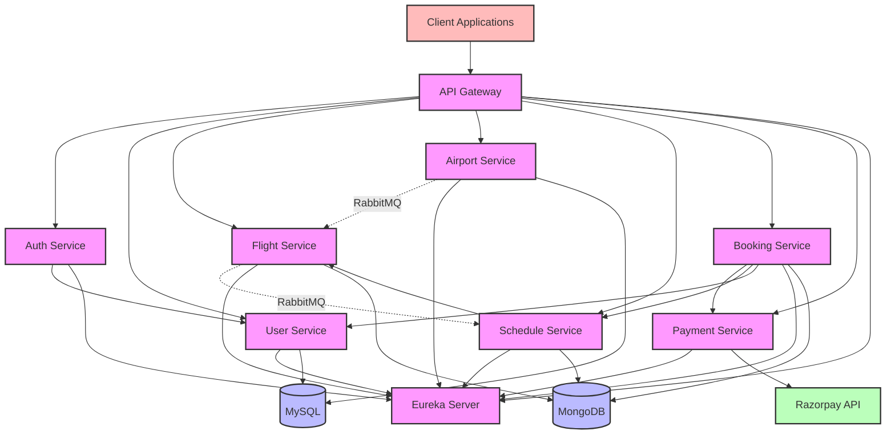
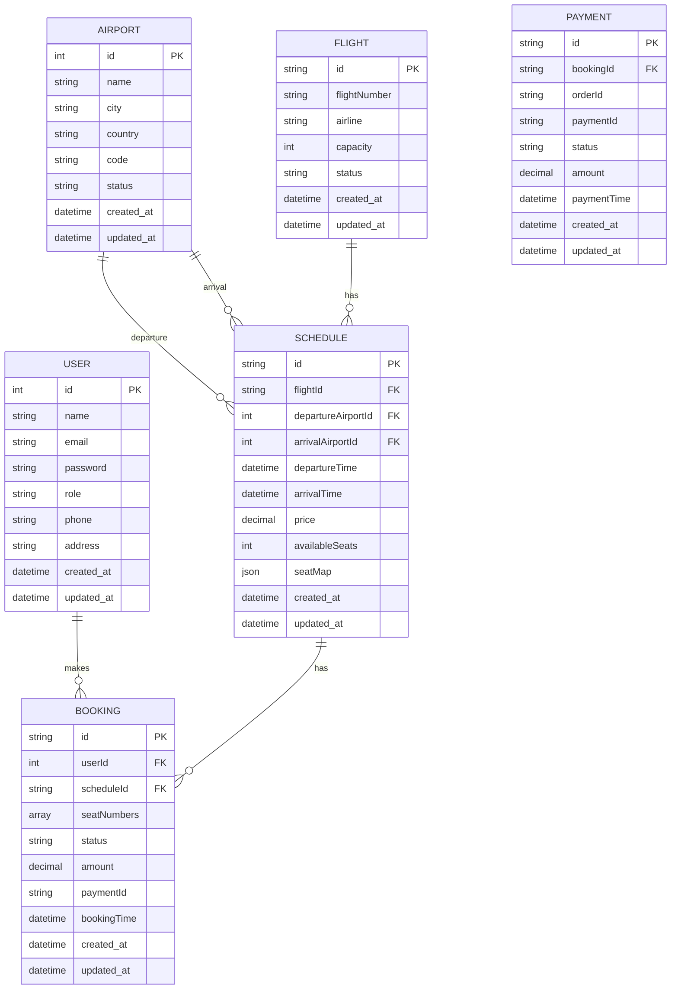

# Aviation Ticketing System

## Overview

The Aviation Ticketing System is a comprehensive microservices-based application designed for managing flight bookings, schedules, payments, and user management. The architecture follows a domain-driven design approach with separate services handling specific business domains, ensuring scalability, maintainability, and resilience.

## Architecture Diagram



## Database Schema



## Microservices

The project consists of the following microservices:

1. **User Service (Port: 9000)**: Manages user data, profiles, and operations.
2. **Auth Service (Port: 9002)**: Handles authentication, authorization, and JWT token management.
3. **Flight Service (Port: 9003)**: Manages flight information and operations.
4. **Airport Service (Port: 9001)**: Manages airport data and information.
5. **Schedule Service (Port: 9004)**: Manages flight schedules and seat availability.
6. **Booking Service (Port: 9005)**: Handles booking operations and integration with payment service.
7. **Payment Service (Port: 9006)**: Processes payments using Razorpay integration.
8. **API Gateway (Port: 8080)**: Acts as a single entry point for all client requests, handling routing and security.
9. **Eureka Server (Port: 8761)**: Service registry for service discovery and load balancing.

## Technologies Used

- **Spring Boot**: Framework for building microservices
- **Spring Cloud**: For service discovery, configuration, and gateway
- **Spring Security**: For securing the application with JWT authentication
- **MongoDB**: NoSQL database for booking, flight, and schedule services
- **MySQL**: Relational database for user and airport data
- **JWT**: For token-based authentication
- **Razorpay**: Payment gateway integration
- **RabbitMQ**: Message broker for asynchronous communication between airport, schedule, and flight services
- **Docker**: For containerization of services
- **Docker Compose**: For orchestrating multi-container applications
- **Lombok**: For reducing boilerplate code
- **Feign Client**: For synchronous service-to-service communication
- **Maven**: For dependency management and build

## Service Communication

The microservices in this system communicate using both synchronous and asynchronous patterns:

### Synchronous Communication (Feign Client)
- **Auth Service → User Service**: Retrieves user details for authentication
- **API Gateway → Auth Service**: Validates JWT tokens
- **Schedule Service → Flight Service**: Retrieves flight details when creating/updating schedules
- **Booking Service → Payment Service**: Creates payment orders
- **Booking Service → Schedule Service**: Checks schedule availability
- **Booking Service → User Service**: Validates user information

### Asynchronous Communication (RabbitMQ)
- **Flight Service → Schedule Service**: Flight status updates that affect schedules
- **Airport Service → Flight Service**: Airport status changes that affect flights

### Communication Flow Examples

1. **Booking Flow**:
   - Client → API Gateway → Booking Service (create booking request)
   - Booking Service → Schedule Service (via Feign): Check seat availability
   - Booking Service → Payment Service (via Feign): Create payment order
   - Booking Service → Client: Return payment order details
   - Client → Payment Service: Complete payment
   - Payment Service → Booking Service (via Feign): Payment confirmation
   - Booking Service → Schedule Service (via Feign): Update seat availability

2. **Authentication Flow**:
   - Client → API Gateway → Auth Service: Login request
   - Auth Service → User Service (via Feign): Validate credentials
   - Auth Service → Client: Return JWT token
   - Subsequent requests: API Gateway validates JWT token

3. **Flight Status Update Flow**:
   - Admin updates flight status in Flight Service
   - Flight Service publishes status change to RabbitMQ
   - Schedule Service consumes message and updates affected schedules

4. **Airport Status Update Flow**:
   - Admin updates airport status in Airport Service
   - Airport Service publishes status change to RabbitMQ
   - Flight Service consumes message and updates affected flights

## Security

- JWT-based authentication and authorization
- Role-based access control (RBAC)
- API Gateway security filtering
- RSA key-based token signing
- Secure inter-service communication

## Project Structure

```
aviation-ticketing-system/
├── api-gateway/            # API Gateway service
├── auth-service/           # Authentication service
├── user-service/           # User management service
├── flight-service/         # Flight management service
├── airport-service/        # Airport management service
├── schedule-service/       # Schedule management service
├── booking-service/        # Booking management service
├── payment-service/        # Payment processing service
├── eureka-server/          # Service discovery server
├── docker-compose.yml      # Docker Compose configuration
└── README.md               # Main project documentation
```

## Getting Started

### Prerequisites

- Java 17 or higher
- Maven 3.6+
- MongoDB
- MySQL
- RabbitMQ
- Docker and Docker Compose (optional, for containerized deployment)

### Installation

1. Clone the repository:
   ```bash
   git clone <repository-url>
   ```

2. Navigate to the project directory:
   ```bash
   cd aviation-ticketing-system
   ```

3. Build all services using Maven:
   ```bash
   mvn clean install
   ```

### Running Using Docker

For easy deployment, use Docker Compose:

```bash
docker-compose up -d
```

This will start all services in detached mode.

### Running Services Individually

1. **Start the Eureka Server**:
   ```bash
   cd eureka-server
   mvn spring-boot:run
   ```

2. **Start the API Gateway**:
   ```bash
   cd api-gateway
   mvn spring-boot:run
   ```

3. **Start other services** in a similar manner, making sure the Eureka Server is running first.

## API Endpoints

### User Management
- **Register**: POST `/auth-service/api/register`
- **Login**: POST `/auth-service/api/login`
- **Get User Profile**: GET `/user-service/api/user/{id}`
- **Update User Profile**: PUT `/user-service/api/user/{id}`

### Flight & Schedule Management
- **Get Flights**: GET `/flight-service/api/flights`
- **Get Flight by ID**: GET `/flight-service/api/flight/{id}`
- **Create Flight**: POST `/flight-service/api/flight` (Admin only)
- **Update Flight**: PUT `/flight-service/api/flight/{id}` (Admin only)
- **Delete Flight**: DELETE `/flight-service/api/flight/{id}` (Admin only)
- **Get Schedules**: GET `/schedule-service/api/schedules`
- **Get Schedule by ID**: GET `/schedule-service/api/schedule/{id}`
- **Create Schedule**: POST `/schedule-service/api/schedule` (Admin only)
- **Update Schedule**: PUT `/schedule-service/api/schedule/{id}` (Admin only)
- **Delete Schedule**: DELETE `/schedule-service/api/schedule/{id}` (Admin only)

### Airport Management
- **Get Airports**: GET `/airport-service/api/airports`
- **Get Airport by ID**: GET `/airport-service/api/airport/{id}`
- **Create Airport**: POST `/airport-service/api/airport` (Admin only)
- **Update Airport**: PUT `/airport-service/api/airport/{id}` (Admin only)
- **Delete Airport**: DELETE `/airport-service/api/airport/{id}` (Admin only)

### Booking & Payment
- **Create Order**: POST `/booking-service/api/create-order`
- **Confirm Booking**: POST `/booking-service/api/booking`
- **Get User Bookings**: GET `/booking-service/api/bookings/user/{userId}`
- **Get All Bookings**: GET `/booking-service/api/bookings` (Admin only)
- **Process Payment**: POST `/payment-service/api/order`
- **Verify Payment**: POST `/payment-service/api/verify`

## Service Descriptions

Each service has its own detailed README file with specific information about:
- Core components
- Data models
- Dependencies
- Configuration options
- API endpoints
- Error handling

## Contributors

- [Your Name]

## License

[Your License]
