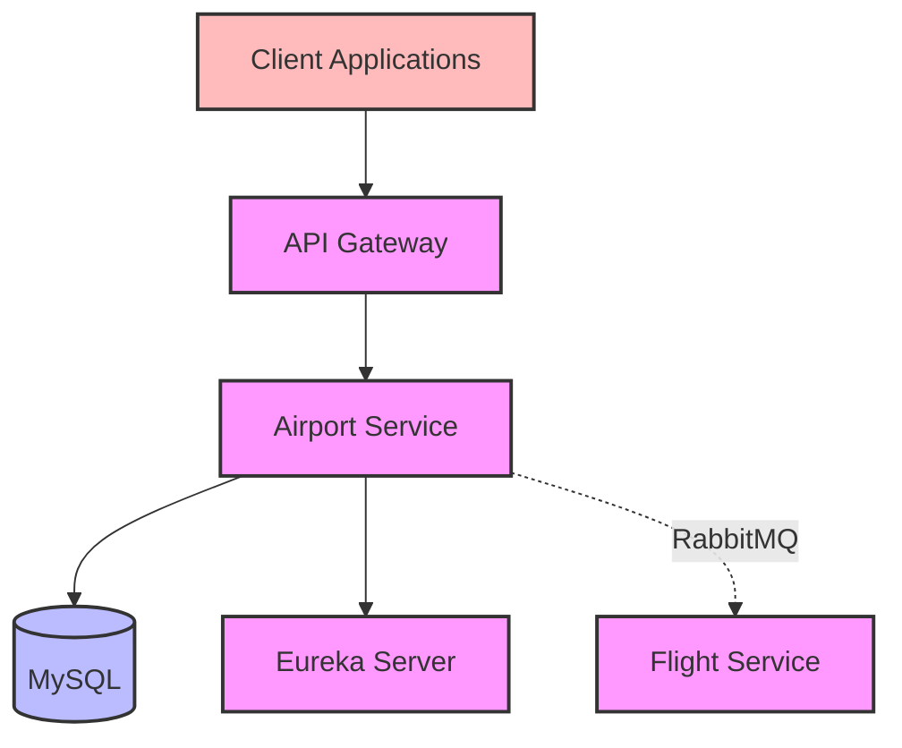
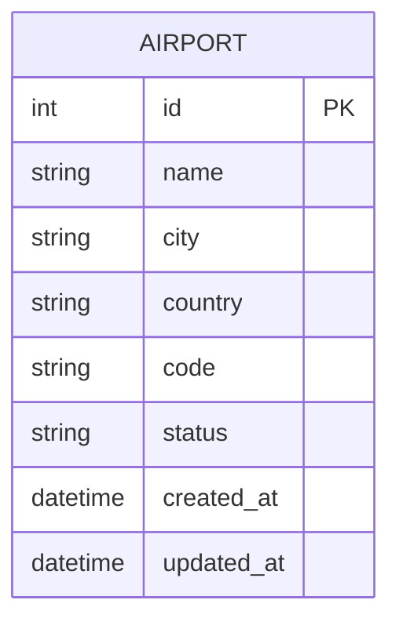

# Airport Service Documentation

## Overview
The Airport Service manages airport-related operations in the aviation ticketing system. It handles airport information management and coordinates with the Flight Service for flight status updates. This service is responsible for maintaining airport data that is critical for flight scheduling and operations.

## Architecture



## Core Components

### 1. AirportService Interface
- Defines core airport management operations
- Methods:
    - `getAllAirports()` - Retrieve all airports
    - `createAirport(AirportRequest)` - Create new airport
    - `deleteAirportById(int)` - Delete specific airport
    - `getAirportById(int)` - Get airport by ID
    - `updateAirport(AirportRequest)` - Update airport details

### 2. AirportServiceImpl
- Implements AirportService interface
- Features:
    - Airport CRUD operations
    - Integration with Flight Service
    - Data validation and error handling
    - Airport mapping between DTOs and entities
    - RabbitMQ message publishing for airport status updates

### 3. AirportController
- REST controller for airport operations
- Endpoints:
    - GET `/api/airports` - Get all airports
    - GET `/api/airport/{id}` - Get airport by ID
    - POST `/api/airport` - Create new airport
    - PUT `/api/airport/{id}` - Update airport
    - DELETE `/api/airport/{id}` - Delete airport

### 4. RabbitMQ Message Publishers
- Handles asynchronous airport status notifications
- Components:
    - Airport status message publisher
    - Airport event models
    - RabbitMQ configuration

## Data Model



## Dependencies
- Spring Boot Starter Web
- Spring Cloud Netflix Eureka Client
- Spring Data JPA
- MySQL Connector
- Spring AMQP (RabbitMQ)
- Lombok
- Spring Boot DevTools
- Spring Boot Starter Test

## Service Communication

### Asynchronous Communication (RabbitMQ)
- **Airport Service → Flight Service**: Sends airport status updates

## Features
- Complete airport management system
- Data validation and error handling
- Service discovery integration
- DTO pattern for data transfer
- Asynchronous airport status notifications
- MySQL for relational airport data storage

## Error Handling
- AirportDoesntExistException
- CommunicationFailedException
- Validation errors for invalid requests
- Database connection errors
- Message publishing errors

## Integration Points
- Flight Service for status updates
- Service Registry for service discovery
- MySQL database for airport data persistence
- RabbitMQ for asynchronous messaging

## Configuration
- Server port: 9001
- MySQL configuration:
  - Connection settings
  - JPA/Hibernate settings
- Eureka client configuration
- RabbitMQ configuration:
  - Exchange name: "airport-exchange"
  - Routing key: "airport.status"
  - Message converter settings
  - Publisher confirms

## Getting Started

### Prerequisites
- Java 17 or higher
- Maven 3.6+
- MySQL
- RabbitMQ
- Eureka Server running

### Running the Service

1. **Start the Eureka Server** first (if not already running)

2. **Start MySQL and RabbitMQ**

3. **Start the Airport Service**:
   ```bash
   cd airport-service
   mvn spring-boot:run
   ```

4. **Verify the service** is registered with Eureka at http://localhost:8761

### Docker Deployment

```bash
docker build -t airport-service .
docker run -p 9001:9001 airport-service
```

## API Endpoints

| Method | Endpoint | Description |
|--------|----------|-------------|
| GET | `/api/airports` | Get all airports |
| GET | `/api/airport/{id}` | Get airport by ID |
| POST | `/api/airport` | Create new airport |
| PUT | `/api/airport/{id}` | Update airport |
| DELETE | `/api/airport/{id}` | Delete airport |

## Message Flow Example

### Airport Status Update Flow:
1. Admin updates airport status in Airport Service
2. Airport Service publishes status change to RabbitMQ
3. Flight Service consumes message and updates affected flights

## Testing

The service includes comprehensive tests:
- Unit tests for service layer
- Integration tests for controller layer
- Repository tests for data access
- Message publishing tests

Run tests with:
```bash
mvn test
```

# Spring Boot

### Reference Documentation
For further reference, please consider the following sections:

* [Official Apache Maven documentation](https://maven.apache.org/guides/index.html)
* [Spring Boot Maven Plugin Reference Guide](https://docs.spring.io/spring-boot/3.4.3/maven-plugin)
* [Create an OCI image](https://docs.spring.io/spring-boot/3.4.3/maven-plugin/build-image.html)
* [Spring Web](https://docs.spring.io/spring-boot/3.4.3/reference/web/servlet.html)
* [Spring Data JPA](https://docs.spring.io/spring-boot/3.4.3/reference/data/sql.html#data.sql.jpa-and-spring-data)
* [Spring Boot DevTools](https://docs.spring.io/spring-boot/3.4.3/reference/using/devtools.html)

### Guides
The following guides illustrate how to use some features concretely:

* [Building a RESTful Web Service](https://spring.io/guides/gs/rest-service/)
* [Serving Web Content with Spring MVC](https://spring.io/guides/gs/serving-web-content/)
* [Building REST services with Spring](https://spring.io/guides/tutorials/rest/)
* [Accessing Data with JPA](https://spring.io/guides/gs/accessing-data-jpa/)
* [Accessing data with MySQL](https://spring.io/guides/gs/accessing-data-mysql/)

### Maven Parent overrides

Due to Maven's design, elements are inherited from the parent POM to the project POM.
While most of the inheritance is fine, it also inherits unwanted elements like `<license>` and `<developers>` from the parent.
To prevent this, the project POM contains empty overrides for these elements.
If you manually switch to a different parent and actually want the inheritance, you need to remove those overrides.

