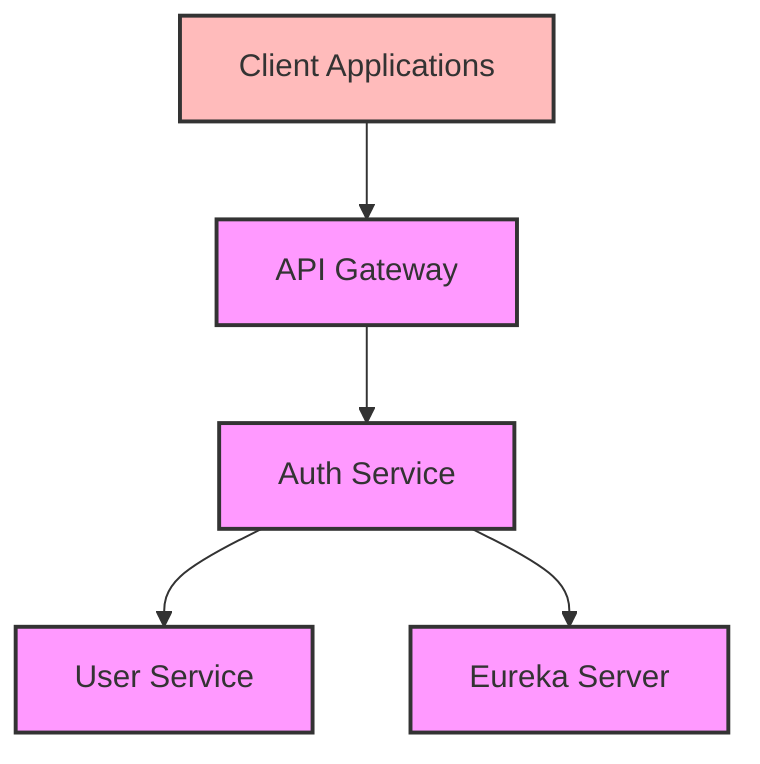
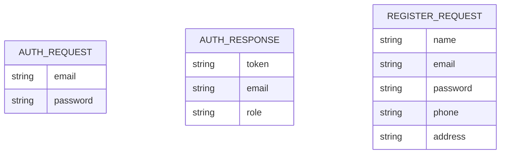

# Auth Service Documentation

## Overview
The Auth Service is responsible for handling user authentication and authorization in the aviation ticketing system. It provides JWT (JSON Web Token) based authentication and integrates with the User Service for user management. This service is a critical security component that ensures secure access to all other services in the system.

## Architecture



## Core Components

### 1. UserDetailsServiceImpl
- Implements Spring Security's `UserDetailsService`
- Communicates with User Service to load user details
- Converts User data into Spring Security compatible UserDetails

### 2. JwtService
- Handles JWT token generation and management
- Features:
    - Token generation with email and role claims
    - RSA private key-based token signing
    - 30-minute token expiration
    - Secure key handling using environment variables

### 3. UserServiceCommunication (Feign Client)
- Interfaces with the User Service
- Endpoints:
    - GET `/api/user/email/{email}` - Retrieve user by email
    - POST `/api/user` - Create new user

### 4. AuthController
- REST controller for authentication operations
- Endpoints:
    - POST `/api/register` - Register a new user
    - POST `/api/login` - Authenticate user and generate JWT token
    - POST `/api/validate` - Validate JWT token

## Data Model



## Dependencies
- Spring Boot Starter Security
- Spring Boot Starter Web
- Spring Cloud OpenFeign
- Spring Cloud Netflix Eureka Client
- JWT (jsonwebtoken) libraries:
    - jjwt-api
    - jjwt-impl
    - jjwt-jackson
- Lombok
- Spring Boot DevTools
- Spring Boot Starter Test

## Service Communication

### Synchronous Communication (Feign Client)
- **Auth Service → User Service**: Retrieves user details for authentication
- **Auth Service → User Service**: Creates new user during registration

## Security Features
- Implements Spring Security for authentication
- Uses JWT tokens for stateless authentication
- RSA-based token signing for enhanced security
- Role-based access control
- Integration with User Service for credential verification
- Password encryption
- Token expiration and refresh mechanism
- Secure error handling

## Configuration
- Server port: 9002
- JWT configuration:
  - Requires JWT_PRIVATE_SECRET environment variable for token signing
  - Token expiration: 30 minutes
  - Algorithm: RS256 (RSA with SHA-256)
- Eureka client configuration
- Feign client configuration

## Error Handling
- Authentication failures
- User not found scenarios
- Invalid token errors
- Registration validation errors
- Service communication errors
- Secure error responses

## Integration Points
- User Service for user management
- API Gateway for token validation
- Service Registry for service discovery

## Getting Started

### Prerequisites
- Java 17 or higher
- Maven 3.6+
- User Service running
- Eureka Server running

### Environment Variables
```bash
export JWT_PRIVATE_SECRET="your-private-key-here"
```

### Running the Service

1. **Start the Eureka Server** first (if not already running)

2. **Start the User Service** (required for authentication)

3. **Start the Auth Service**:
   ```bash
   cd auth-service
   mvn spring-boot:run
   ```

4. **Verify the service** is registered with Eureka at http://localhost:8761

### Docker Deployment

```bash
docker build -t auth-service .
docker run -p 9002:9002 -e JWT_PRIVATE_SECRET="your-private-key-here" auth-service
```

## API Endpoints

| Method | Endpoint | Description |
|--------|----------|-------------|
| POST | `/api/register` | Register a new user |
| POST | `/api/login` | Authenticate user and generate JWT token |
| POST | `/api/validate` | Validate JWT token |

## Authentication Flow

1. **Registration**:
   - Client sends registration request to Auth Service
   - Auth Service validates request data
   - Auth Service calls User Service to create new user
   - Auth Service returns success response

2. **Login**:
   - Client sends login credentials to Auth Service
   - Auth Service calls User Service to validate credentials
   - Auth Service generates JWT token if credentials are valid
   - Auth Service returns token to client

3. **Token Validation**:
   - Client includes JWT token in Authorization header
   - API Gateway validates token with Auth Service
   - If valid, request proceeds to target service
   - If invalid, request is rejected

## Testing

The service includes comprehensive tests:
- Unit tests for JWT service
- Integration tests for authentication flow
- Security tests for token validation

Run tests with:
```bash
mvn test
```

# Spring Boot

### Reference Documentation
For further reference, please consider the following sections:

* [Official Apache Maven documentation](https://maven.apache.org/guides/index.html)
* [Spring Boot Maven Plugin Reference Guide](https://docs.spring.io/spring-boot/3.4.3/maven-plugin)
* [Create an OCI image](https://docs.spring.io/spring-boot/3.4.3/maven-plugin/build-image.html)
* [Spring Boot DevTools](https://docs.spring.io/spring-boot/3.4.3/reference/using/devtools.html)
* [Spring Security](https://docs.spring.io/spring-boot/3.4.3/reference/web/spring-security.html)
* [Spring Web](https://docs.spring.io/spring-boot/3.4.3/reference/web/servlet.html)
* [OpenFeign](https://docs.spring.io/spring-cloud-openfeign/reference/)

### Guides
The following guides illustrate how to use some features concretely:

* [Securing a Web Application](https://spring.io/guides/gs/securing-web/)
* [Spring Boot and OAuth2](https://spring.io/guides/tutorials/spring-boot-oauth2/)
* [Authenticating a User with LDAP](https://spring.io/guides/gs/authenticating-ldap/)
* [Building a RESTful Web Service](https://spring.io/guides/gs/rest-service/)
* [Serving Web Content with Spring MVC](https://spring.io/guides/gs/serving-web-content/)
* [Building REST services with Spring](https://spring.io/guides/tutorials/rest/)

### Additional Links
These additional references should also help you:

* [Declarative REST calls with Spring Cloud OpenFeign sample](https://github.com/spring-cloud-samples/feign-eureka)

### Maven Parent overrides

Due to Maven's design, elements are inherited from the parent POM to the project POM.
While most of the inheritance is fine, it also inherits unwanted elements like `<license>` and `<developers>` from the parent.
To prevent this, the project POM contains empty overrides for these elements.
If you manually switch to a different parent and actually want the inheritance, you need to remove those overrides.

