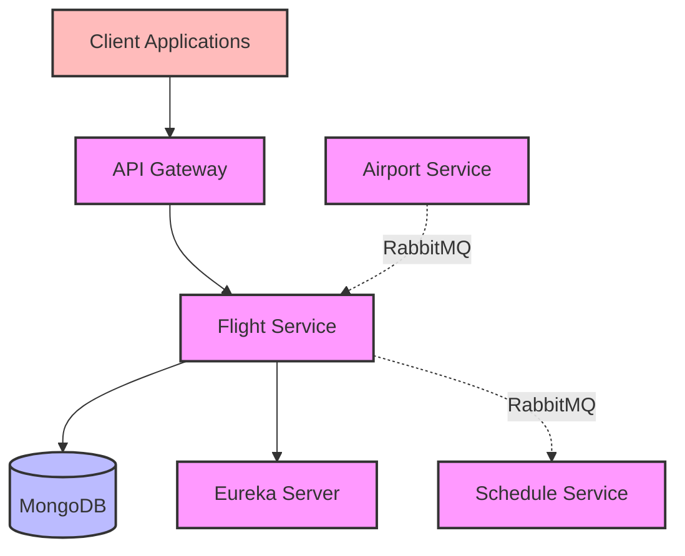
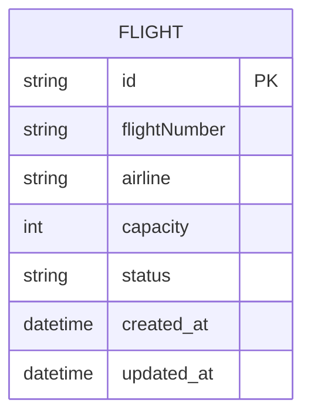

# Flight Service Documentation

## Overview
The Flight Service manages flight-related operations in the aviation ticketing system. It handles flight creation, retrieval, updates, and deletion while maintaining communication with the Schedule Service for coordinated operations. This service is responsible for maintaining the core flight data that schedules and bookings depend on.

## Architecture



## Core Components

### 1. FlightService Interface
- Defines core flight management operations
- Methods:
    - `createFlight(FlightRequest)` - Create new flight
    - `getFlightById(String)` - Retrieve flight by ID
    - `getAllFlights()` - Get all flights
    - `updateFlight(FlightRequest)` - Update flight details
    - `deleteFlightById(String)` - Delete specific flight
    - `deleteAllFlights()` - Delete all flights

### 2. FlightServiceImpl
- Implements FlightService interface
- Features:
    - Flight CRUD operations
    - Integration with Schedule Service
    - Data validation and error handling
    - Flight mapping between DTOs and entities
    - RabbitMQ message publishing for flight status updates

### 3. ScheduleServiceCommunicator (Feign Client)
- Handles communication with Schedule Service
- Operations:
    - Delete schedules by flight ID
    - Delete all schedules

### 4. FlightController
- REST controller for flight operations
- Endpoints:
    - GET `/api/flights` - Get all flights
    - GET `/api/flight/{id}` - Get flight by ID
    - POST `/api/flight` - Create new flight
    - PUT `/api/flight/{id}` - Update flight
    - DELETE `/api/flight/{id}` - Delete flight
    - DELETE `/api/flights` - Delete all flights

### 5. RabbitMQ Message Publishers
- Handles asynchronous flight status notifications
- Components:
    - Flight status message publisher
    - Flight event models
    - RabbitMQ configuration

## Data Model



## Dependencies
- Spring Boot Starter Web
- Spring Cloud Netflix Eureka Client
- Spring Cloud OpenFeign
- Spring Data MongoDB
- Spring AMQP (RabbitMQ)
- Lombok
- Spring Boot DevTools
- Spring Boot Starter Test

## Service Communication

### Synchronous Communication (Feign Client)
- **Schedule Service → Flight Service**: Retrieves flight details when creating/updating schedules

### Asynchronous Communication (RabbitMQ)
- **Flight Service → Schedule Service**: Sends flight status updates
- **Airport Service → Flight Service**: Receives airport status changes

## Features
- Complete flight management system
- Automatic schedule cleanup on flight deletion
- Data validation and error handling
- Service discovery integration
- DTO pattern for data transfer
- Asynchronous flight status notifications
- MongoDB for flexible flight data storage

## Error Handling
- FlightNotFoundException
- CommunicationFailedException for service communication issues
- Validation errors for invalid requests
- Database connection errors
- Message publishing errors

## Integration Points
- Schedule Service for coordinated operations
- Airport Service for status updates
- Service Registry for service discovery
- MongoDB database for flight data persistence
- RabbitMQ for asynchronous messaging

## Configuration
- Server port: 9003
- MongoDB configuration:
  - Connection settings
  - Collection mappings
- Eureka client configuration
- Feign client configuration
- RabbitMQ configuration:
  - Exchange name: "flight-exchange"
  - Routing key: "flight.status"
  - Message converter settings
  - Publisher confirms

## Getting Started

### Prerequisites
- Java 17 or higher
- Maven 3.6+
- MongoDB
- RabbitMQ
- Eureka Server running

### Running the Service

1. **Start the Eureka Server** first (if not already running)

2. **Start MongoDB and RabbitMQ**

3. **Start the Flight Service**:
   ```bash
   cd flight-service
   mvn spring-boot:run
   ```

4. **Verify the service** is registered with Eureka at http://localhost:8761

### Docker Deployment

```bash
docker build -t flight-service .
docker run -p 9003:9003 flight-service
```

## API Endpoints

| Method | Endpoint | Description |
|--------|----------|-------------|
| GET | `/api/flights` | Get all flights |
| GET | `/api/flight/{id}` | Get flight by ID |
| POST | `/api/flight` | Create new flight |
| PUT | `/api/flight/{id}` | Update flight |
| DELETE | `/api/flight/{id}` | Delete flight |
| DELETE | `/api/flights` | Delete all flights |

## Message Flow Example

### Flight Status Update Flow:
1. Admin updates flight status in Flight Service
2. Flight Service publishes status change to RabbitMQ
3. Schedule Service consumes message and updates affected schedules

## Testing

The service includes comprehensive tests:
- Unit tests for service layer
- Integration tests for controller layer
- Repository tests for data access
- Message publishing tests

Run tests with:
```bash
mvn test
``` 