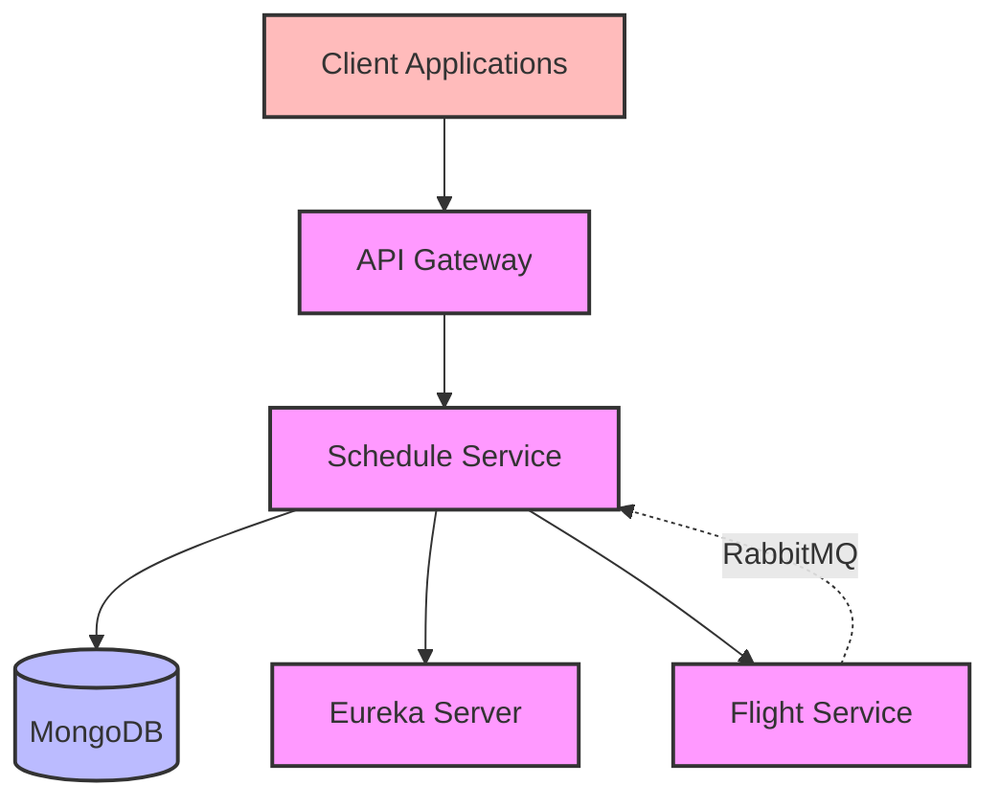
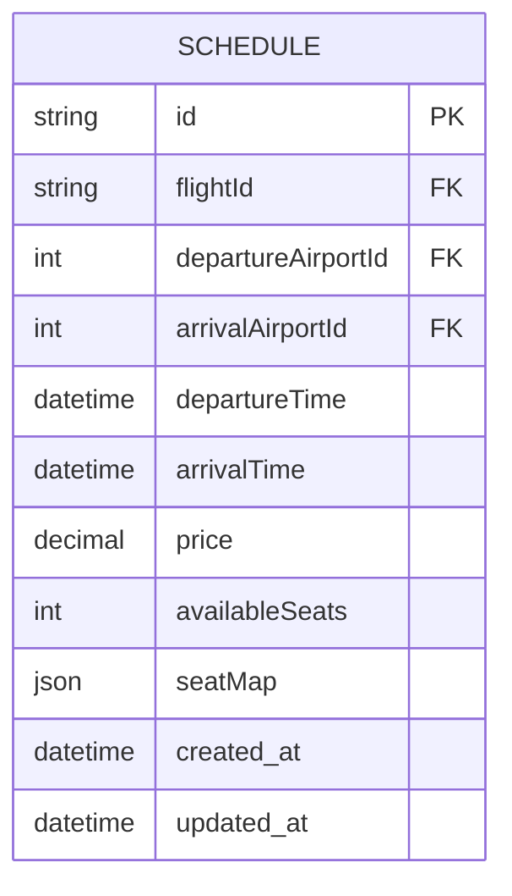

# Schedule Service Documentation

## Overview
The Schedule Service manages flight schedules in the aviation ticketing system. It handles the creation, management, and coordination of flight schedules while maintaining integration with the Flight Service. This service is responsible for managing flight schedules, seat availability, and pricing, which are critical for the booking process.

## Architecture



## Core Components

### 1. ScheduleService Interface
- Defines core schedule management operations
- Methods:
    - `createSchedule(ScheduleRequest)` - Create new schedule
    - `getAllSchedules()` - Retrieve all schedules
    - `deleteScheduleById(String)` - Delete specific schedule
    - `deleteAllSchedules()` - Delete all schedules
    - `getScheduleById(String)` - Get schedule by ID
    - `updateSchedule(ScheduleRequest)` - Update schedule
    - `deleteByAirportId(int)` - Delete schedules by airport
    - `deleteByFlightId(String)` - Delete schedules by flight
    - `updateSeatAvailability(String, List<Integer>)` - Update seat availability

### 2. ScheduleServiceImpl
- Implements ScheduleService interface
- Features:
    - Schedule CRUD operations
    - Integration with Flight Service
    - Schedule validation and error handling
    - Mapping between DTOs and entities
    - RabbitMQ message consumption for flight status updates

### 3. FlightServiceCommunicator (Feign Client)
- Interfaces with Flight Service
- Operations:
    - Get flight details by ID

### 4. ScheduleController
- REST controller for schedule operations
- Endpoints:
    - GET `/api/schedules` - Get all schedules
    - GET `/api/schedule/{id}` - Get schedule by ID
    - POST `/api/schedule` - Create new schedule
    - PUT `/api/schedule/{id}` - Update schedule
    - DELETE `/api/schedule/{id}` - Delete schedule
    - DELETE `/api/schedules` - Delete all schedules
    - PUT `/api/schedule/{id}/seats` - Update seat availability

### 5. RabbitMQ Message Consumers
- Handles asynchronous flight status notifications
- Components:
    - Flight status message consumer
    - Flight event models
    - RabbitMQ configuration

## Data Model



## Dependencies
- Spring Boot Starter Web
- Spring Cloud Netflix Eureka Client
- Spring Cloud OpenFeign
- Spring Boot MongoDB Starter
- Spring AMQP (RabbitMQ)
- Lombok
- Spring Boot DevTools
- Spring Boot Starter Test

## Service Communication

### Synchronous Communication (Feign Client)
- **Schedule Service → Flight Service**: Retrieves flight details when creating/updating schedules
- **Booking Service → Schedule Service**: Checks schedule availability and updates seat availability

### Asynchronous Communication (RabbitMQ)
- **Flight Service → Schedule Service**: Receives flight status updates

## Features
- Complete schedule management
- Seat management system
- Integration with Flight Service
- MongoDB-based persistence
- Service discovery integration
- DTO pattern for data transfer
- Asynchronous flight status updates
- Seat availability tracking

## Error Handling
- NoScheduleFoundException
- InvalidCredentials
- CommunicationFailedException
- Validation errors
- Database connection errors
- Message consumption errors

## Integration Points
- Flight Service for flight validation
- Booking Service for seat availability
- MongoDB for data persistence
- Service Registry for service discovery
- RabbitMQ for asynchronous messaging

## Configuration
- Server port: 9004
- MongoDB configuration:
  - Connection settings
  - Collection mappings
- Eureka client configuration
- Feign client configuration
- RabbitMQ configuration:
  - Queue name: "flight-status-queue"
  - Exchange name: "flight-exchange"
  - Routing key: "flight.status"
  - Message converter settings

## Getting Started

### Prerequisites
- Java 17 or higher
- Maven 3.6+
- MongoDB
- RabbitMQ
- Eureka Server running

### Running the Service

1. **Start the Eureka Server** first (if not already running)

2. **Start MongoDB and RabbitMQ**

3. **Start the Flight Service** (required for flight validation)

4. **Start the Schedule Service**:
   ```bash
   cd schedule-service
   mvn spring-boot:run
   ```

5. **Verify the service** is registered with Eureka at http://localhost:8761

### Docker Deployment

```bash
docker build -t schedule-service .
docker run -p 9004:9004 schedule-service
```

## API Endpoints

| Method | Endpoint | Description |
|--------|----------|-------------|
| GET | `/api/schedules` | Get all schedules |
| GET | `/api/schedule/{id}` | Get schedule by ID |
| POST | `/api/schedule` | Create new schedule |
| PUT | `/api/schedule/{id}` | Update schedule |
| DELETE | `/api/schedule/{id}` | Delete schedule |
| DELETE | `/api/schedules` | Delete all schedules |
| PUT | `/api/schedule/{id}/seats` | Update seat availability |

## Message Flow Example

### Flight Status Update Flow:
1. Admin updates flight status in Flight Service
2. Flight Service publishes status change to RabbitMQ
3. Schedule Service consumes message and updates affected schedules

## Testing

The service includes comprehensive tests:
- Unit tests for service layer
- Integration tests for controller layer
- Repository tests for data access
- Message consumption tests

Run tests with:
```bash
mvn test
``` 