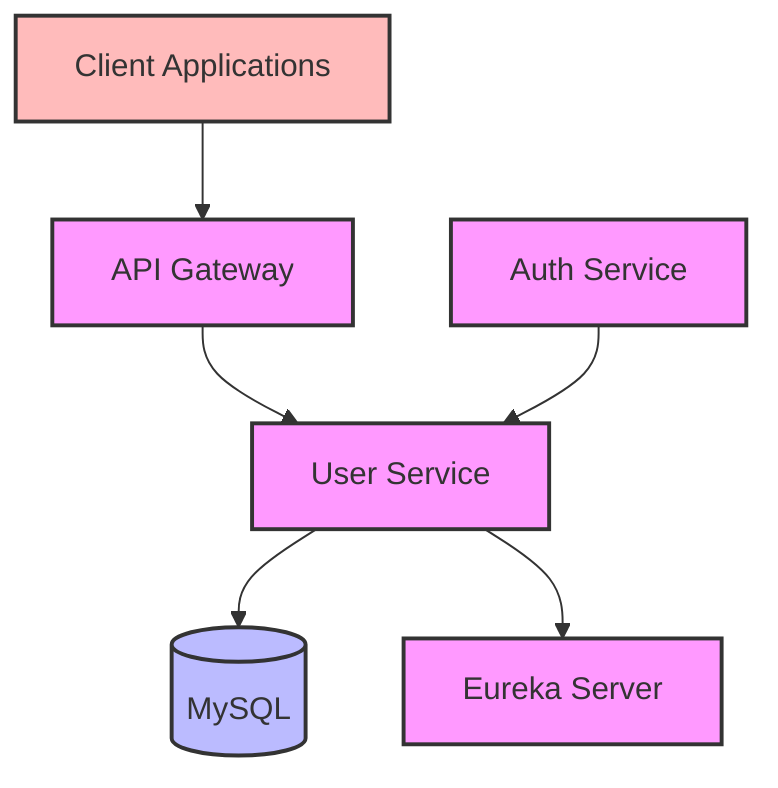
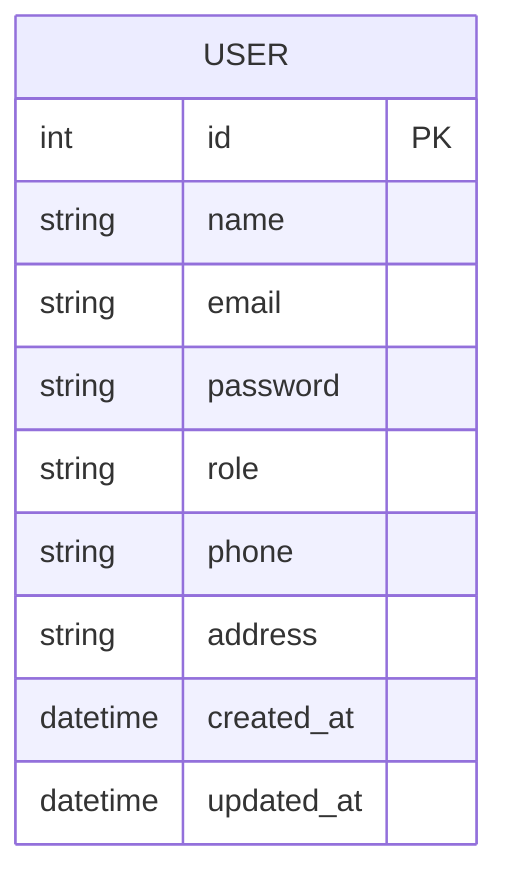

# User Service

## Overview
The User Service manages user-related operations in the aviation ticketing system. It provides user management functionality including creation, retrieval, updates, and deletion of user accounts. This service is a critical component that supports authentication, authorization, and user profile management.

## Architecture



## Core Components

### 1. UserService Interface
- Defines core user management operations
- Methods:
    - `createUser(UserRequest)` - Create new user
    - `getUserByEmail(String)` - Retrieve user by email
    - `getUserById(int)` - Get user by ID
    - `getAllUsers()` - Get all users
    - `updateUser(UserRequest)` - Update user details
    - `deleteUserById(int)` - Delete specific user
    - `deleteAllUsers()` - Delete all users

### 2. UserServiceImpl
- Implements UserService interface
- Features:
    - User CRUD operations
    - Email-based user lookup
    - Data validation
    - User mapping between DTOs and entities

### 3. UserController
- REST controller for user operations
- Endpoints:
    - GET `/api/user/{id}` - Get user by ID
    - GET `/api/user/email/{email}` - Get user by email
    - GET `/api/users` - Get all users
    - POST `/api/user` - Create new user
    - PUT `/api/user/{id}` - Update user
    - DELETE `/api/user/{id}` - Delete user
    - DELETE `/api/users` - Delete all users

## Data Model



## Dependencies
- Spring Boot Starter Web
- Spring Data JPA
- MySQL Connector
- Lombok
- Spring Cloud Netflix Eureka Client
- Spring Boot DevTools
- Spring Boot Starter Test

## Features
- Complete user management system
- Email-based user lookup
- Role-based user management
- Data validation and error handling
- Service discovery integration
- DTO pattern for data transfer
- Secure password storage
- User profile management

## Service Communication

### Synchronous Communication (Feign Client)
- **Auth Service → User Service**: Retrieves user details for authentication
- **Booking Service → User Service**: Validates user information for bookings

## Error Handling
- UserNotFoundException
- UserAlreadyExistsException
- NoUsersFoundException
- Validation errors
- Database connection errors
- Service communication errors

## Security Features
- Password encryption
- Role-based access control
- Email validation
- Unique email enforcement
- Input validation
- SQL injection prevention

## Integration Points
- Auth Service for authentication
- Booking Service for user validation
- Service Registry for service discovery
- MySQL database for user data persistence

## Configuration
- Server port: 9000
- Database configuration:
  - MySQL connection
  - JPA/Hibernate settings
- Eureka client configuration
- Exception handling setup
- Mapper configuration

## Getting Started

### Prerequisites
- Java 17 or higher
- Maven 3.6+
- MySQL database

### Running the Service

1. **Start the Eureka Server** first (if not already running)

2. **Start the User Service**:
   ```bash
   cd user-service
   mvn spring-boot:run
   ```

3. **Verify the service** is registered with Eureka at http://localhost:8761

### Docker Deployment

```bash
docker build -t user-service .
docker run -p 9000:9000 user-service
```

## API Endpoints

| Method | Endpoint | Description |
|--------|----------|-------------|
| GET | `/api/user/{id}` | Get user by ID |
| GET | `/api/user/email/{email}` | Get user by email |
| GET | `/api/users` | Get all users |
| POST | `/api/user` | Create new user |
| PUT | `/api/user/{id}` | Update user |
| DELETE | `/api/user/{id}` | Delete user |
| DELETE | `/api/users` | Delete all users |

## Testing

The service includes comprehensive tests:
- Unit tests for service layer
- Integration tests for controller layer
- Repository tests for data access

Run tests with:
```bash
mvn test
``` 